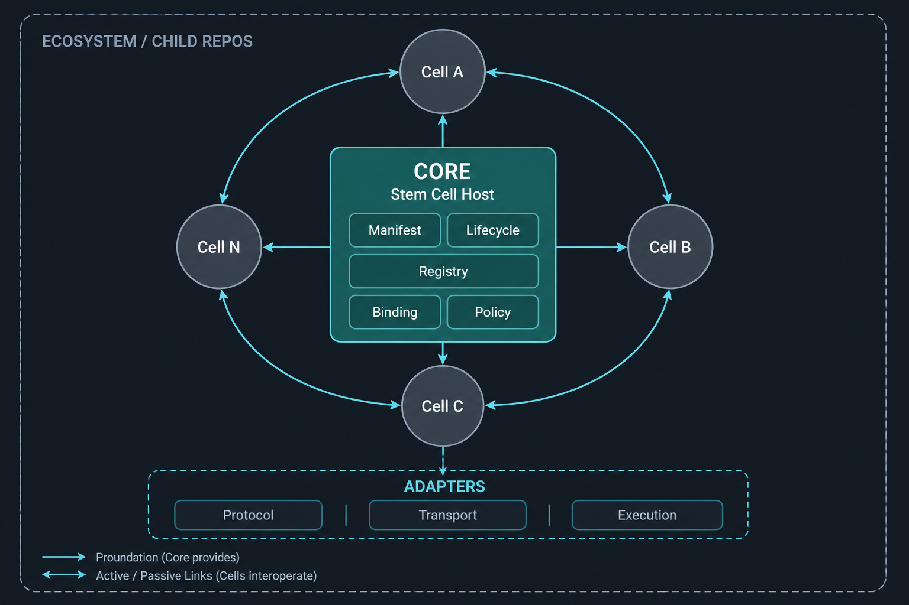
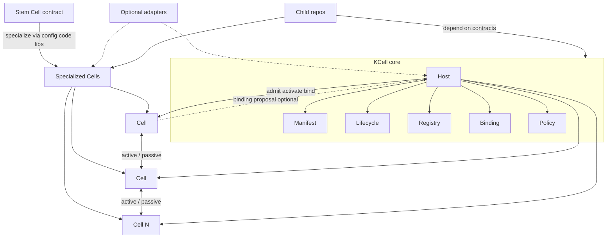

# KCell

<p align="center">
  
</p>

Composable AI cells. Build specialized agents from a **Stem Cell**, compose them into an **AI-man**, and let them discover and connect at runtime.

## Idea

- **Cell** — one AI unit with *active* (outbound) and *passive* (inbound) communication
- **Stem Cell** — generic base that absorbs config, libraries, and code to become any specialized Cell
- **AI-man** — a folder of Cells composed together (like an organism made of many cells)

Example (non-normative): one possible AI-man might wire a local model Cell, a chat UI Cell, and an auto-config Cell — then add another model Cell later. That scenario is illustrative only; the architecture does not prescribe those roles.

## High-level architecture

KCell’s job is the **core Cell runtime and contracts** — the kernel other Cells and child repos specialize on. Product roles (models, UIs, tools, routers, …) are not fixed by this repo; they are just Specialized Cells built elsewhere.

<p align="center">
  
</p>



| Layer | What it is | What it is not |
|-------|------------|----------------|
| **Core / Host** | Tiny mechanisms: manifest, lifecycle, registry, binding, deny-by-default policy, execution interfaces | Not a product app, not a model vendor layer, not a UI kit |
| **Stem Cell** | Generic specialize-from-inputs contract (config, code, libraries → Cell package) | Not a hard-coded “brain” or “chat” type |
| **Specialized Cell** | Any package that declares capabilities, ports, and permissions | Not limited to the demo Cells in `examples/` |
| **Active / Passive** | Communication *capabilities* on the same Cell | Not two separate Cell species |
| **Adapters** | Optional bridges (protocols, transports, executors) outside core | Not required to invent a Cell |
| **AI-man** | Composition of Cells + bindings + shared policy | Not a fixed topology from this README |

Anything domain-specific belongs in a **Cell** or a **child repo** that depends on these contracts. Core stays stable so extension stays open-ended.

## Non-functional requirements

KCell is the **kernel** other child repos build on. Full normative text: [`docs/nfr.md`](docs/nfr.md).

| NFR | Bar |
|-----|-----|
| **NFR-1 Compactness** | Core stays tiny: only universal mechanisms. One-off features go to Cells / adapters / child repos. |
| **NFR-2 Performance** | Hot paths allocation-light; no broker/DB/telemetry on the default path; respect [`benches/BUDGET.md`](benches/BUDGET.md). |
| **NFR-3 Simple structure** | Shallow layout, one concept one place, schemas as source of truth, thin CLI. |
| **NFR-4 Extensibility** | New Cell kinds, protocols, and executors plug in **without** rewriting core. |
| **NFR-5 Ecosystem kernel** | Stable versioned contracts so Cell / AI-man / adapter repos can depend on KCell as shared core. |

## Quick start

```bash
cargo build --release
cargo run -- validate cells/echo-cell/cell.yaml --json
cargo run -- run examples/echo-aiman/ai-man.yaml --root . --json
cargo run -- new my-cell
```

## Design principles

- **Kernel, not product** — KCell is the shared core for child repos; products live outside
- **Mechanisms, not policies** — Host enforces lifecycle/binding/policy primitives; routing and UX stay in Cells
- **Adapters outside core** — AG-UI, A2A, MCP, transports stay optional packages
- **Local-first** — one machine for MVP; contracts stay portable to multi-host later
- **Untrusted by default** — deny-by-default capabilities / sandbox
- **Agent-authored** — schemas, CLI, and docs stay machine-clear for coding agents

See [`docs/nfr.md`](docs/nfr.md) for the binding non-functional requirements.

## Repository layout

```text
crates/kcell-core/   # Host runtime (mechanisms only)
crates/kcell-cli/    # kcell CLI (new, validate, inspect, run)
schemas/             # cell.yaml, ai-man.yaml, binding contracts
adapters/            # Protocol / transport adapters (out of core)
cells/               # Reference / specialized Cells
examples/            # Minimal AI-man compositions
docs/                # Specs, images, and agent authoring guides
benches/             # Performance budgets
AGENTS.md            # Instructions for AI coding agents
```

## Status

Core MVP in progress: manifests, lifecycle, local registry, binding proposals, policy gate, CLI.

## License

[MIT](LICENSE)
