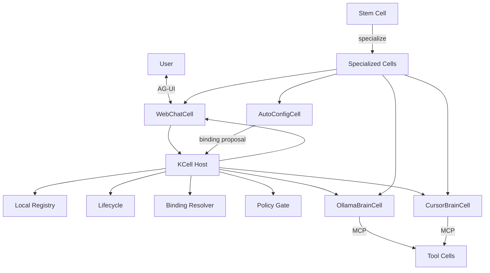

# KCell

<p align="center">
  
</p>

Composable AI cells. Build specialized agents from a **Stem Cell**, compose them into an **AI-man**, and let them discover and connect at runtime.

## Idea

- **Cell** — one AI unit with *active* (outbound) and *passive* (inbound) communication
- **Stem Cell** — generic base that absorbs config, libraries, and code to become any specialized Cell
- **AI-man** — a folder of Cells composed together (like an organism made of many cells)

Example path: an Ollama brain Cell + web chatbot Cell + auto-config Cell become a local chat AI-man. Drop in a Cursor CLI brain later — the Host discovers it and the UI can offer Composer without rewriting the other Cells.

## High-level architecture

<p align="center">
  
</p>



| Layer | Responsibility |
|-------|----------------|
| **Host core** | Manifests, lifecycle, registry, binding apply, deny-by-default policy — no product logic |
| **Stem → Specialized Cells** | Absorb config/code/libs into versioned Cell packages (brain, UI, auto-config, …) |
| **Active / Passive** | Same Cell can call out and accept inbound work; not two hard Cell types |
| **Adapters (out of core)** | AG-UI (user), A2A (agent↔agent), MCP (tools/data) |
| **AI-man** | Composition manifest: which Cells, bindings, and shared policy to activate together |

Control plane stays small. Routing strategy, model vendors, and UI live in Cells or adapters — not in `kcell_core`.

## Non-functional requirements

KCell is the **kernel** other child repos build on. Full normative text: [`docs/nfr.md`](docs/nfr.md).

| NFR | Bar |
|-----|-----|
| **NFR-1 Compactness** | Core stays tiny: only universal mechanisms. One-off features go to Cells / adapters / child repos. |
| **NFR-2 Performance** | Hot paths allocation-light; no broker/DB/telemetry on the default path; respect [`benches/BUDGET.md`](benches/BUDGET.md). |
| **NFR-3 Simple structure** | Shallow layout, one concept one place, schemas as source of truth, thin CLI. |
| **NFR-4 Extensibility** | New Cell kinds, protocols, and executors plug in **without** rewriting core. |
| **NFR-5 Ecosystem kernel** | Stable versioned contracts so Cell / AI-man / adapter repos can depend on KCell as shared core. |

## Quick start

```bash
cargo build --release
cargo run -- validate cells/echo-cell/cell.yaml --json
cargo run -- run examples/echo-aiman/ai-man.yaml --root . --json
cargo run -- new my-cell
```

## Design principles

- **Kernel, not product** — KCell is the shared core for child repos; products live outside
- **Mechanisms, not policies** — Host enforces lifecycle/binding/policy primitives; routing and UX stay in Cells
- **Adapters outside core** — AG-UI, A2A, MCP, transports stay optional packages
- **Local-first** — one machine for MVP; contracts stay portable to multi-host later
- **Untrusted by default** — deny-by-default capabilities / sandbox
- **Agent-authored** — schemas, CLI, and docs stay machine-clear for coding agents

See [`docs/nfr.md`](docs/nfr.md) for the binding non-functional requirements.

## Repository layout

```text
crates/kcell-core/   # Host runtime (mechanisms only)
crates/kcell-cli/    # kcell CLI (new, validate, inspect, run)
schemas/             # cell.yaml, ai-man.yaml, binding contracts
adapters/            # Protocol / transport adapters (out of core)
cells/               # Reference / specialized Cells
examples/            # Minimal AI-man compositions
docs/                # Specs, images, and agent authoring guides
benches/             # Performance budgets
AGENTS.md            # Instructions for AI coding agents
```

## Status

Core MVP in progress: manifests, lifecycle, local registry, binding proposals, policy gate, CLI.

## License

[MIT](LICENSE)
